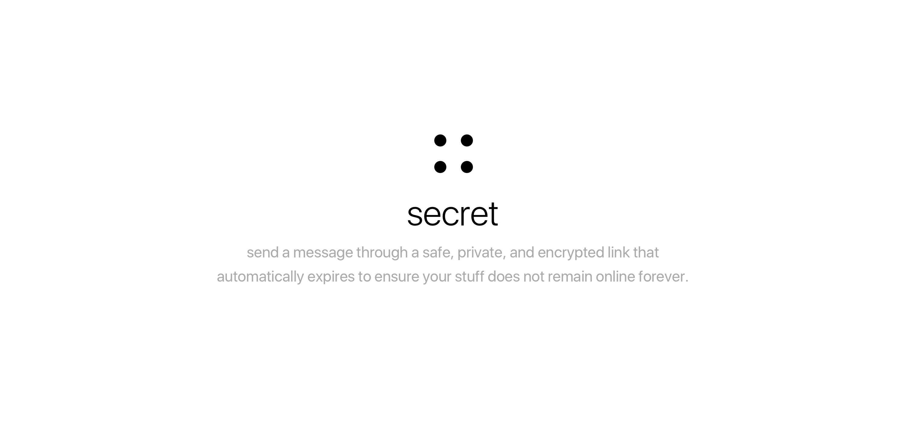

send a message through a safe, private, and encrypted link that automatically expires to ensure your stuff does not remain online forever.

[](https://travis-ci.org/bukinoshita/secret)
[](https://github.com/sindresorhus/xo)
[](https://github.com/prettier/prettier)


## Quick Start

To check it live, go to [secret](https://getsecret.now.sh).

OR

To run it locally on your own computer:

- Clone the repository
- Install the dependencies
- Create `.env` file on the root and set `API=https://getsecret-api.now.sh APP=https://getsecret.now.sh`
- Run the project
- Open your browser on https://localhost:3000
- Check our [API](https://github.com/bukinoshita/secret-api) (private)

```bash
$ git clone https://github.com/bukinoshita/secret.git && cd secret && yarn && echo 'API=https://getsecret-api.now.sh APP=https://getsecret.now.sh' > .env && yarn dev
```


## Contributing

Please see our [contributing.md](https://github.com/bukinoshita/secret/blob/master/contributing.md).


## Sponsors


